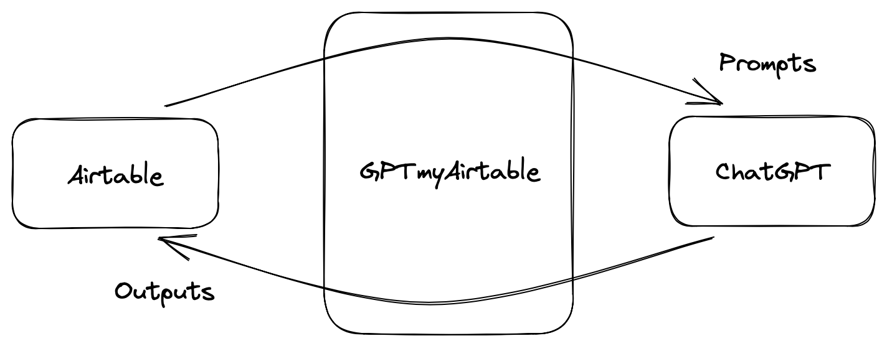
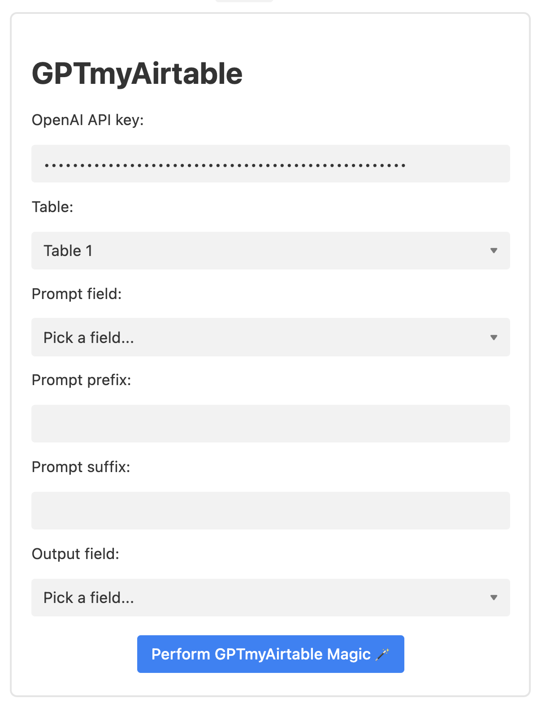

# GPTmyAirtable

Are you tired of repetitively submitting prompts into ChatGPT web interface? This powerful Airtable extension automates the process of submitting prompts directly from Airtable to ChatGPT, streamlining your workflow and allowing you to focus on what really matters. Say goodbye to tedious, manual tasks and hello to increased productivity and efficiency!

## Example uses

1. Summarize multiple articles, e.g., news & academic paper abstracts, at once
2. Translate long documents in chunks (workaround to the prompt length limit)
3. Grade students' assignments (or screen whether they used ChatGPT)

## Requirements

1. [OpenAI API key](https://platform.openai.com) — This extension does not collect any of your data, including the API key. All data is sent directly to OpenAI's servers via front-end web requests.
2. [Airtable Blocks development prerequisites](https://airtable.com/developers/extensions/guides/getting-started#prerequisites)

## How to use

1. Open your Airtable base and go to the "Extensions" tab on the top right corner.
2. Select "Build an extension" and choose "Remix from GitHub" with this repo URL: `https://github.com/na399/GPTmyAirtable`
3. Follow [Airtable's instructions](https://airtable.com/developers/extensions/guides/remix-from-github) to set up your extension.
4. Run the extension on your Airtable! It should look like this:

## Remarks

The extension is currently in development.
